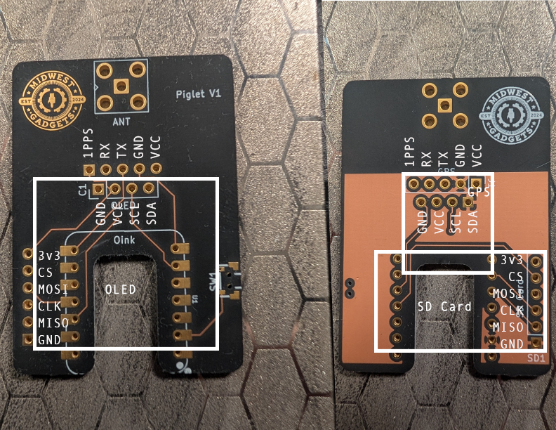

# Piglet Wardriver

**Piglet** is an open-source ESP32-based wardriving platform that scans nearby Wi-Fi networks, records GPS position, saves WiGLE-compatible CSV logs to SD, and provides a real-time web UI for control, uploads, and device status.

Designed for **Seeed XIAO ESP32-S3, ESP32-C5, and ESP32-C6**, Piglet focuses on:

- Reliable scanning while in motion  
- Clean WiGLE-ready data collection  
- Simple field deployment  
- Fully hackable open firmware

## Features

- 2.4 GHz Wi-Fi scanning  
- 5 GHz scanning on ESP32-C5 hardware  
- GPS position, heading, and speed logging  
- SD card logging in WiGLE CSV format  
- Web UI for:
  - Start / stop scanning  
  - Upload logs to WiGLE  
  - View device status  
  - Manage SD files  
  - Edit configuration  
- OLED live status display  
- Optional battery monitoring (board dependent)  
- Automatic STA connect with AP fallback  
- Network de-duplication  
- Optimized for mobile wardriving or warWalking!
- **ESP-Now Mesh Node mode** — pair with a coordinator device for multi-node wardriving

## ESP-Now Mesh Network Node Mode

Piglet includes a built-in **Mesh Node mode** that lets it act as a wireless wardriving node alongside a compatible coordinator device. In this mode, Piglet scans Wi-Fi networks and forwards results over ESP-Now — no SD card or GPS fix required on Piglet itself. The coordinator handles GPS stamping and data logging.

### Compatible Coordinator Devices

- **Biscuit Pro** by [Hedge / Biscuit Shop](https://biscuitshop.us)
- **JCMK C5 Wardriver** by JustCallMeKoko

### How to Use

1. Power on your coordinator device (Biscuit Pro or JCMK C5 Wardriver)
2. On Piglet, press the button to cycle pages until you reach **Mesh Node** (the last page after the pig animation)
3. Piglet automatically searches for a coordinator on ESP-Now channel 6
4. Once connected, it receives a channel range assignment and begins forwarding scan data
5. Press the button again to exit Mesh Node mode and return to normal wardriving

### Mesh Node Display

While in Mesh Node mode the OLED shows:
- Link status (Searching / Core linked)
- Coordinator MAC address
- Assigned channel range
- Total networks discovered
- Records forwarded to the coordinator

> **Note:** Entering Mesh Node mode suspends normal WiGLE CSV logging. All data is sent live to the coordinator. Exiting the page restores normal scanning automatically.

## T-Dongle C5 Variant

A standalone firmware port is available for the **LilyGo T-Dongle C5** in the `TDongleC5_Piglet/` folder. This variant is a self-contained single-file sketch with its own display driver, LED control, and web UI — no external OLED required.

**Hardware:** LilyGo T-Dongle C5 (ESP32-C5, built-in ST7735 0.96" TFT, APA102 LED, TF card slot)

**Additional GPS:** Connect any UART GPS module via the Qwiic/JST connector (RX=GPIO12, TX=GPIO11)

**Pages:** Status · Networks · Navigation · Pig animation · Mesh Node

### T-Dongle C5 Required Libraries

Install via Arduino Library Manager (`Sketch → Include Library → Manage Libraries`):

| Library | Author |
|---------|--------|
| Adafruit ST7735 and ST7789 Library | Adafruit |
| Adafruit GFX Library | Adafruit |
| Adafruit BusIO | Adafruit |
| TinyGPSPlus | Mikal Hart |
| ArduinoJson | Benoit Blanchon |

All networking, SPI, SD, ESP-Now, and ESP-IDF headers are included in the ESP32 Arduino core — no separate install needed.

**Board setup:** Add `https://espressif.github.io/arduino-esp32/package_esp32_dev_index.json` to Additional Boards Manager URLs, install **esp32 by Espressif v3.x or later**, and select **ESP32C5 Dev Module**.

## Supported Hardware

### Microcontroller Boards

- Seeed XIAO ESP32-S3  
- Seeed XIAO ESP32-C5 *(required for 5 GHz scanning)*  
- Seeed XIAO ESP32-C6  
- LilyGo T-Dongle C5 *(standalone variant — see above)*  

### Required Peripherals

- I2C GPS module (ATGM336H)
- 128×64 SSD1306 OLED display (I2C)
- I2C SD card module
- Optional LiPo battery connected to XIAO battery inputs

### Peripheral Sourcing  
You can get everything on Amazon but its pricey.  if you dont mind waiting on aliexpress heres the build list.
- Xiao-C5 - 7$ [SeedStudio](https://www.seeedstudio.com/Seeed-Studio-XIAO-ESP32C5-p-6609.html)
- SSD1306 128x63 OLED - $2 [aliexpress](https://www.aliexpress.us/item/3256805954920554.html)
- ATGM-336h - $3.39 [aliexpress](https://www.aliexpress.us/item/3256809330278648.html)
- SD-Card Module - $1.33 [aliexpress](https://www.aliexpress.us/item/3256808167816573.html)
- User Button - $0.41 [Item:CS1211 From Digikey](https://www.digikey.com/en/products/detail/cit-relay-and-switch/CS1211/16607858)

$14 if you wanted to breadboard it yourself.

## Wiring / Pinouts

Pin mappings are automatically selected by firmware.

### XIAO ESP32-S3

| Function | Pin |
|----------|-----|
| I2C SDA | GPIO 5 |
| I2C SCL | GPIO 6 |
| GPS RX | GPIO 4 |
| GPS TX | GPIO 7 |
| Button | GPIO 1 |
| SD CS | GPIO 2 |
| SD MOSI | GPIO 10 |
| SD MISO | GPIO 9 |
| SD SCK | GPIO 8 |

### XIAO ESP32-C6 / ESP32-C5

| Function | Pin |
|----------|-----|
| I2C SDA | GPIO 23 |
| I2C SCL | GPIO 24 |
| GPS RX | GPIO 12 |
| GPS TX | GPIO 11 |
| Button | GPIO 0 |
| SD CS | GPIO 7 |
| SD MOSI | GPIO 10 |
| SD MISO | GPIO 9 |
| SD SCK | GPIO 8 |

**Note:** Only the ESP32-C5 supports 5 GHz Wi-Fi scanning.

## 3D Printed Cases

Print-ready STL files are available in the `Case Files/` directory. These cases are designed specifically for the Piglet PCB and module stack.

| File | Description |
|------|-------------|
| `Piglet Face.STL` | Front panel / lid |
| `Piglet Butt.STL` | Rear enclosure |
| `Piglet Butt with SMA hole.STL` | Rear enclosure with external antenna cutout |
| `Piglet Midboard.STL` | Internal standoff / mid-layer |
| `Piglet Features.stl` | Feature plate / accessory mount |

For the **T-Dongle C5** variant, GPS antenna mount STLs are included in `TDongleC5_Piglet/GPS STL/`.

> Print with standard PLA or PETG. No supports required on most parts. Recommend 0.2 mm layer height, 3 perimeters.

## PCB Design

Piglet includes custom PCB designs for compact, production-ready builds. KiCad project files and Gerber production files are available in the `PCB Files/` directory.

### PCB Images

| Board Front | Board Back | Board Close-up |
|-------------|------------|----------------|
|  |  |  |

### Assembled Piglet

| Module Arrangement | Front View | Back View |
|--------------------|------------|----------|
|  |  |  |

**Assembly Note:** When stacking modules, apply **Kapton tape** between components to prevent electrical shorts. Pay special attention to exposed pins and solder joints that may contact adjacent modules.

## Configuration File

Default Config below. 

Location: /wardriver.cfg on SD card

XIAO Wardriver config (key=value)

wigleBasicToken="Encoded for Use Wigle Api Token"

homeSsid=YourSSID

homePsk=YourPSK

wardriverSsid=WarHam

wardriverPsk=wardrive1234

gpsBaud=9600

scanMode=aggressive

board=auto

## Button Functions

### Single Press - Stop/Start scanning
### Long Press - DeepSleep
### Single Press - Exit Deepsleep

## Building Firmware

### Requirements

- **Arduino IDE 2.x** or **PlatformIO**  
- **Arduino-ESP32 core** v3.0.0 or later  

### Required Libraries

Install these libraries via Arduino Library Manager or PlatformIO:

- **WiFi** (built-in with ESP32 core)
- **WebServer** (built-in with ESP32 core)
- **WiFiClientSecure** (built-in with ESP32 core)
- **HTTPClient** (built-in with ESP32 core)
- **SD** (built-in with ESP32 core)
- **SPI** (built-in with ESP32 core)
- **Wire** (built-in with ESP32 core)
- **TinyGPSPlus** by Mikal Hart - [Library Link](https://github.com/mikalhart/TinyGPSPlus)
- **Adafruit GFX Library** - Required dependency for SSD1306
- **Adafruit SSD1306** - OLED display driver
- **ArduinoJson** by Benoit Blanchon - v6.x or v7.x

### Flash Steps

1. Select the correct **XIAO ESP32 board** variant (S3, C5, or C6)
2. **CRITICAL:** Enable **PSRAM** (required for TLS/HTTPS uploads)
   - Tools → PSRAM → **OPI PSRAM** (C5/C6) or **QSPI PSRAM** (S3)
3. Use a **large app partition scheme** → **Huge APP (3MB No OTA/1MB SPIFFS)**
4. Upload firmware  
5. Insert **FAT32-formatted SD card**  
6. Add `/wardriver.cfg` to SD card root with your WiGLE API key and WiFi credentials
7. Restart device with RST button or power cycle

## License

Creative Commons Attribution-NonCommercial 4.0 (CC BY-NC 4.0)

You may:

- Use  
- Modify  
- Share  

You may **not** use this project for commercial purposes.

https://creativecommons.org/licenses/by-nc/4.0/

---

Created by **Midwewest Gadgets LLC**

